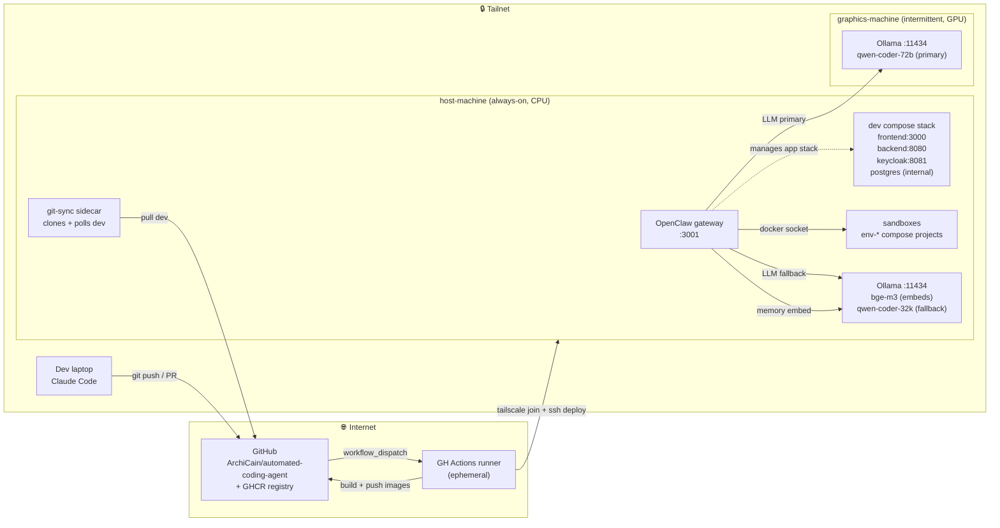
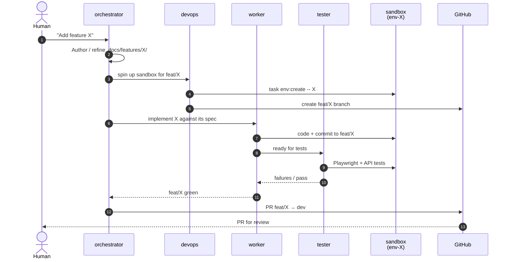
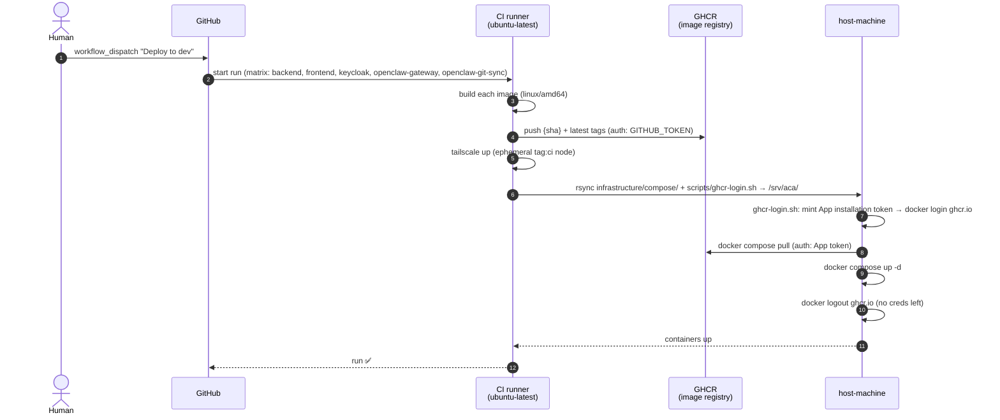

# Ecosystem

Top-level map of what runs where, how code flows from the laptop to the
deploy target, and how a task flows through OpenClaw to a PR.

## Actors

| Actor | Role | How it's edited |
|---|---|---|
| **Dev laptop** | Where a human drives Claude Code, opens PRs, reviews OpenClaw output | — |
| **GitHub** (`ArchiCain/automated-coding-agent`) | Source of truth + GHCR registry + Actions runners | — |
| **CI runner** (ephemeral, GitHub-hosted) | Builds images, joins tailnet, calls `scripts/deploy.sh` | `.github/workflows/` |
| **host-machine** (always-on Ubuntu, tailnet) | Runs the compose stack (app + OpenClaw + sandboxes) + embedding/fallback LLM | Edited indirectly — code is shipped via CI deploy |
| **graphics-machine** (intermittent Ubuntu, tailnet, GPU) | Serves the primary coding LLM via Ollama | Out of scope for this repo — configured out-of-band |

Tailscale assigns the actual hostnames for host-machine and graphics-machine;
docs refer to them by role.

## System at a glance



## Runtime: how a task flows through the system

When a human drops a task into OpenClaw, the four agents collaborate on a
feature branch, each writing to the parts of the repo they own (see
`CLAUDE.md` and `projects/openclaw/.docs/overview.md`).



Stream A (orchestrator authoring docs/config) commits directly to `dev` —
no PR, just chat review. Stream B (feature work) is the flow above.

## Deploy flow

Deployment is explicit, not automatic — the dev branch is OpenClaw's
working branch and gets deployed to host-machine only when a human dispatches
the workflow.



The host reads from `/srv/aca/infrastructure/compose/{dev,openclaw}/`.
`.env` files on the host stay put between deploys; only the compose
files are rsynced. First-time setup is manual (see "Bootstrapping a host"
below).

## Components and where they live

| Component | Directory | Purpose |
|---|---|---|
| Benchmark app — frontend | `projects/application/frontend/` | Angular SPA; what OpenClaw builds features into |
| Benchmark app — backend | `projects/application/backend/` | NestJS REST + Socket.IO |
| Benchmark app — keycloak | `projects/application/keycloak/` | OIDC provider for the app |
| Benchmark app — database | `projects/application/database/` | Postgres (shared across compose + sandboxes) |
| OpenClaw gateway | `projects/openclaw/` | The agent runtime; edited by Claude Code, not by OpenClaw |
| The Dev Team | `projects/the-dev-team/` | Frozen. Prior orchestrator. Don't edit. |
| Dev compose stack | `infrastructure/compose/dev/` | Long-lived stack — app + keycloak + postgres |
| OpenClaw compose stack | `infrastructure/compose/openclaw/` | Gateway + git-sync sidecar |
| Sandbox compose template | `infrastructure/compose/sandbox/` | Per-task `env-{id}` clone of the dev stack |
| Deploy script | `scripts/deploy.sh` | rsync + ssh + compose pull/up for a tailnet host |
| Sandbox scripts | `scripts/sandbox-*.sh` | Lifecycle wrappers called by `task env:*` |
| CI workflows | `.github/workflows/` | `ci.yml` (PR checks), `deploy-dev.yml` (dispatch-only deploy) |

## Bootstrapping a host

First-time setup on host-machine (one-off, done by a human over SSH):

1. Install Docker Engine + `docker compose` plugin. (`openssl`, `curl`,
   and `rsync` are needed too; they're in Ubuntu by default.)
2. Install and authenticate Tailscale (`tailscale up`). Note the
   hostname — this goes in `vars.DEPLOY_HOST` on GitHub.
3. Create the deploy target directories: `sudo install -d -o $USER
   /srv/aca/infrastructure/compose /srv/aca/scripts`.
4. Place the per-compose-project `.env` files:
   - `/srv/aca/infrastructure/compose/dev/.env`
   - `/srv/aca/infrastructure/compose/openclaw/.env`
   See each directory's `.env.template` for the variable set.
5. Place the GitHub App private-key PEM at the host path referenced by
   `GITHUB_APP_PRIVATE_KEY_HOST_PATH` in the openclaw `.env`.
6. In GitHub repo settings → Variables, set `DEPLOY_HOST` to the tailnet
   hostname from step 2 (and `DEPLOY_USER` if the SSH user is not `ubuntu`).
7. Dispatch `Deploy to dev` from the Actions tab.

No `docker login ghcr.io` needed here — the deploy script mints a
short-lived GitHub App installation token on the host at deploy time
(`scripts/ghcr-login.sh`) using the App creds already in the openclaw
`.env`. It runs `docker login`, pulls, and logs out at the end of each
run, leaving no credentials on disk.

### GitHub App permission needed

The App must have **Packages: Read** permission on this repo's GHCR
packages (in addition to whatever it already has for the git-sync
sidecar — typically Contents: Read + Metadata: Read). Without Packages:
Read, `docker pull` will 403 even though login succeeded.

graphics-machine setup is out-of-band — Ollama installed as a systemd
service, models pulled, tailnet-joined. See `ideas/openclaw-local-llm-hybrid.md`
for the running notes.

## What lives where in docs

```
.docs/
├── overview.md                           # Repo-level map — points here
└── standards/
    ├── docs-driven-development.md
    ├── feature-architecture.md
    ├── project-architecture.md
    ├── environment-configuration.md
    ├── task-automation.md
    └── diagrams.md

infrastructure/.docs/
├── overview.md                           # Index for this directory
└── ecosystem.md                          # ← You are here

infrastructure/compose/.docs/
└── overview.md                           # Compose stack layout, ports, sandboxes

.github/.docs/
├── overview.md                           # CI + deploy workflows
├── spec.md                               # Workflow triggers, secrets, services
└── decisions.md                          # Why dispatch-only deploy, etc.

projects/{project}/{service}/.docs/
├── overview.md                           # What this service is, tech stack
├── standards/                            # Per-project conventions
└── features/{feature}/.docs/             # Spec, flows, contracts, test-plan
```
