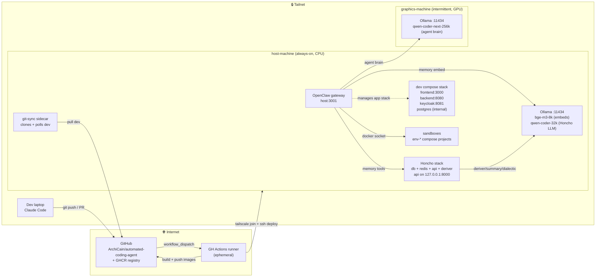
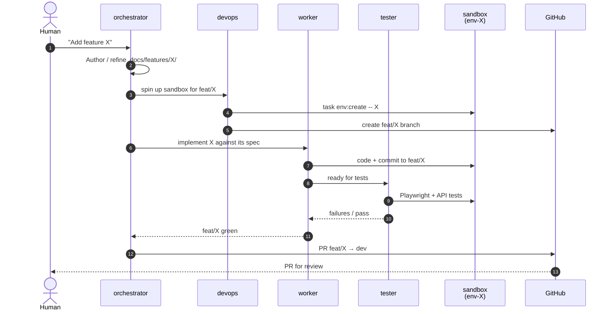
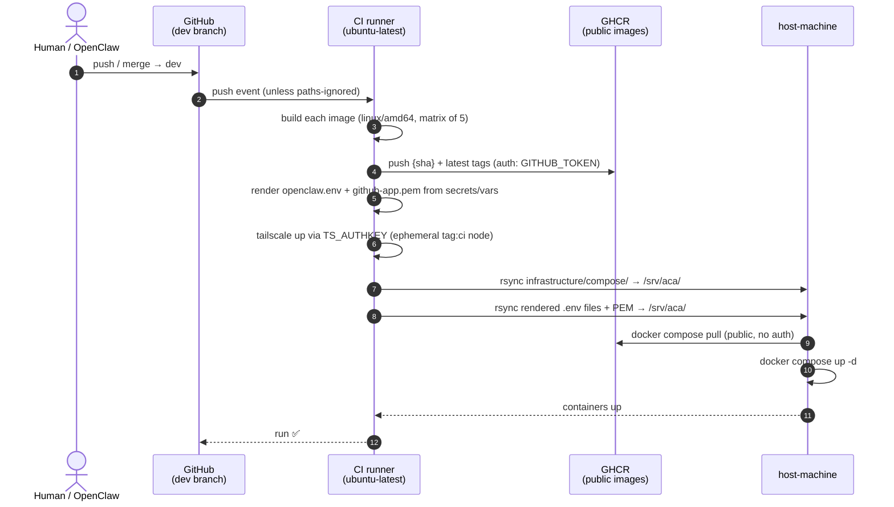

# Ecosystem

Top-level map of what runs where, how code flows from the laptop to the
deploy target, and how a task flows through OpenClaw to a PR.

## Actors

| Actor | Role | How it's edited |
|---|---|---|
| **Dev laptop** | Where a human drives Claude Code, opens PRs, reviews OpenClaw output | — |
| **GitHub** (`ArchiCain/automated-coding-agent`) | Source of truth + GHCR registry + Actions runners | — |
| **CI runner** (ephemeral, GitHub-hosted) | Builds images, joins tailnet, calls `scripts/deploy.sh` | `.github/workflows/` |
| **host-machine** (always-on Ubuntu, tailnet) | Runs the compose stack (app + OpenClaw + sandboxes) + embedding/fallback LLM | Edited indirectly — code is shipped via CI deploy |
| **graphics-machine** (intermittent Ubuntu, tailnet, GPU) | Serves the primary coding LLM via Ollama | Out of scope for this repo — configured out-of-band |

Tailscale assigns the actual hostnames for host-machine and graphics-machine;
docs refer to them by role. Concrete per-host specs (CPU, RAM, Ollama
version, installed models, listen addresses) live in `hosts.md`.

## System at a glance



## Runtime: how a task flows through the system

When a human drops a task into OpenClaw, the four agents collaborate on a
feature branch, each writing to the parts of the repo they own (see
`CLAUDE.md` and `projects/openclaw/.docs/overview.md`).



Stream A (orchestrator authoring docs/config) commits directly to `dev` —
no PR, just chat review. Stream B (feature work) is the flow above.

## Deploy flow

Deployment is automatic on every push/merge to `dev`.
`workflow_dispatch` is also available as a manual override (redeploy
a SHA, target a different host).

Pushes that only touch docs / skills / ideas / CODEOWNERS are skipped
via `paths-ignore` — the git-sync sidecar refreshes those on the
running host within 60s without a rebuild. And `concurrency` on the
workflow guarantees only one deploy runs at a time — a newer push
cancels an older in-flight deploy.



The host reads from `/srv/aca/infrastructure/compose/{dev,openclaw}/`.
`.env` files on the host stay put between deploys; only the compose
files are rsynced. First-time setup is manual (see "Bootstrapping a host"
below).

## Components and where they live

| Component | Directory | Purpose |
|---|---|---|
| Benchmark app — frontend | `projects/application/frontend/` | Angular SPA; what OpenClaw builds features into |
| Benchmark app — backend | `projects/application/backend/` | NestJS REST + Socket.IO |
| Benchmark app — keycloak | `projects/application/keycloak/` | OIDC provider for the app |
| Benchmark app — database | `projects/application/database/` | Postgres (shared across compose + sandboxes) |
| OpenClaw gateway | `projects/openclaw/` | The agent runtime; edited by Claude Code, not by OpenClaw |
| The Dev Team | `projects/the-dev-team/` | Frozen. Prior orchestrator. Don't edit. |
| Dev compose stack | `infrastructure/compose/dev/` | Long-lived stack — app + keycloak + postgres |
| OpenClaw compose stack | `infrastructure/compose/openclaw/` | Gateway + git-sync sidecar |
| Sandbox compose template | `infrastructure/compose/sandbox/` | Per-task `env-{id}` clone of the dev stack |
| Deploy script | `scripts/deploy.sh` | rsync + ssh + compose pull/up for a tailnet host |
| Sandbox scripts | `scripts/sandbox-*.sh` | Lifecycle wrappers called by `task env:*` |
| CI workflows | `.github/workflows/` | `ci.yml` (PR checks), `deploy-dev.yml` (dispatch-only deploy) |

## Bootstrapping a host

First-time setup is split between **the laptop** (populate root `.env`
and push to GitHub once) and **the mac-mini** (install docker +
tailscale + create target directory). GitHub Actions handles everything
else on each deploy.

### On the laptop — one-off

1. Populate `.env` at the repo root using `.env.template` as the guide.
   Seven required values: `TS_AUTHKEY`, `DEPLOY_HOST`,
   `OLLAMA_API_KEY` (any non-empty placeholder; real endpoints are
   pinned in `projects/openclaw/app/openclaw.json`),
   `OPENCLAW_AUTH_TOKEN`, `GITHUB_APP_ID`,
   `GITHUB_APP_INSTALLATION_ID`, and `GITHUB_APP_PRIVATE_KEY_PATH`.
   Two optional overrides (`DEPLOY_USER` defaults to `ubuntu`;
   `DOCKER_SOCKET_GID` defaults to `999`).
2. `task setup:check` — fails loudly if anything's missing or still at
   a placeholder.
3. `task gh:setup` — shows a preview (character counts, no values
   shown), prompts y/N, pushes each value to the repo's GH secrets /
   variables via `gh` over stdin, and flips the repo-level default
   workflow permission to `write` so the workflow can push to GHCR.

### On the mac-mini — one-off

4. Install Docker Engine + `docker compose` plugin.
5. Install and authenticate Tailscale. Rename the machine in the
   Tailscale admin UI to match `DEPLOY_HOST` from the laptop's `.env`
   (convention: `host-machine`).
6. Create the deploy target directory:
   `sudo install -d -o $USER /srv/aca`.

### First deploy

7. Push to `dev` (or dispatch the workflow manually). Actions builds
   images, renders config from secrets, ships to the host, and
   `docker compose up -d`.
8. **First-time only**: go to
   `https://github.com/ArchiCain?tab=packages` (or the repo's Packages
   tab) and flip each of the 5 new packages
   (`automated-coding-agent-{backend, frontend, keycloak,
   openclaw-gateway, openclaw-git-sync}`) to **Public** via each
   package's settings → Danger Zone → Change visibility. Also connect
   each to this repo while you're there. Public packages mean no
   authentication is needed for `docker pull`, so deploy 2+ just works.

### GitHub App — required permissions

The App needs only what OpenClaw's git-sync sidecar needs on this repo:

- **Contents: Read**
- **Metadata: Read**

No `Packages: Read` required, because GHCR pulls go against public
packages after step 8.

### graphics-machine

Out-of-band — Ollama installed natively on Windows, models pulled,
tailnet-joined. Concrete current-state inventory: `hosts.md`. Design
rationale + running notes from when it was set up:
`ideas/openclaw-local-llm-hybrid.md` and
`ideas/graphics-machine-setup.md`.

## What lives where in docs

```
.docs/
├── overview.md                           # Repo-level map — points here
└── standards/
    ├── docs-driven-development.md
    ├── feature-architecture.md
    ├── project-architecture.md
    ├── environment-configuration.md
    ├── task-automation.md
    └── diagrams.md

infrastructure/.docs/
├── overview.md                           # Index for this directory
├── ecosystem.md                          # ← You are here
└── hosts.md                              # Per-host inventory (specs, Ollama, ports)

infrastructure/compose/.docs/
└── overview.md                           # Compose stack layout, ports, sandboxes

.github/.docs/
├── overview.md                           # CI + deploy workflows
├── spec.md                               # Workflow triggers, secrets, services
└── decisions.md                          # Why dispatch-only deploy, etc.

projects/{project}/{service}/.docs/
├── overview.md                           # What this service is, tech stack
├── standards/                            # Per-project conventions
└── features/{feature}/.docs/             # Spec, flows, contracts, test-plan
```
